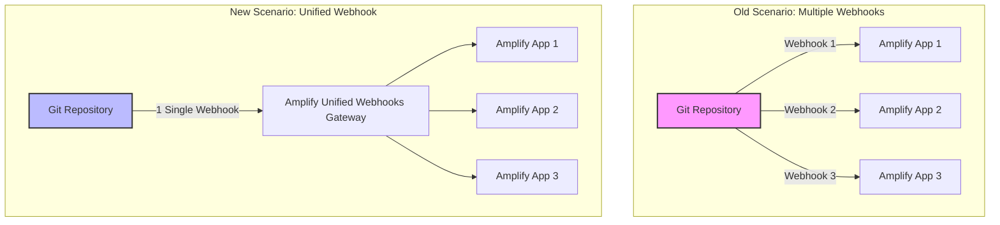

# OPTIMIZING MULTI-APP MANAGEMENT WITH UNIFIED WEBHOOKS ON AWS AMPLIFY HOSTING

In modern software engineering, the **Monorepo** architecture (managing multiple frontend apps and services in a single repository) is highly favored by developers due to easy code sharing and streamlined workspace management. However, when deploying these applications on **AWS Amplify Hosting**, developers often hit a painful barrier: **Git Provider Webhook limits**.

Every time you connect a new Amplify application referencing the same repository, a new webhook is generated and registered with your Git provider. This quickly consumes the webhook quota allowed by popular Git providers:
* **GitHub:** Max limit of **20 webhooks** per repository.
* **GitLab:** Max limit of **100 webhooks** per repository.
* **Bitbucket:** Max limit of **50 webhooks** per repository.

Once you reach these limits, you cannot connect new Amplify apps or configure other external CI/CD pipelines, halting your team's integration workflow.

To resolve this issue, AWS introduced **Unified Webhooks in AWS Amplify Hosting**. This feature consolidates all Amplify-related webhooks for a single repository into a single unified webhook.

{}
**Core Value:** A single webhook represents AWS Amplify Hosting in your repository, automatically routing build triggers to all corresponding Amplify applications.
{}

---

## How Unified Webhooks Work

Here is a visual flow comparing the previous multi-webhook architecture with the new Unified Webhook approach:

---

## Core Benefits

Adopting Unified Webhooks delivers massive benefits to development teams:

* **Overcoming Git Provider Limits:** No more worries about hitting GitHub's 20 webhook limit. You can scale your monorepo to dozens of frontend apps seamlessly.
* **Increased Monorepo Flexibility:** Supports Agile practices by letting teams spawn temporary preview environments for Pull Requests without exhausting webhook slots.
* **Simplified Infrastructure:** Reduces configuration overhead between your Git provider and AWS, avoiding out-of-sync or broken webhooks.
* **Freed Up Webhook Slots:** Retains webhook capacity for third-party integrations (e.g., Slack alerts, SonarQube quality gates, security scanners).

---

## Quick Deployment Walkthrough

Configuring Unified Webhooks is highly straightforward:

### 1. For newly created Amplify apps
This feature is **automatically enabled** when you link a new application to your repository. No manual steps are required.

### 2. For existing Amplify apps
Simply reconnect your repository using these steps:
1. Log in to the **AWS Management Console and search for AWS Amplify**.
2. Select your application, then navigate to **App settings** on the left menu.
3. Click **Branch settings**.
4. Click **Reconnect repository** and follow the authorization prompt. The system will automatically consolidate the webhook into the unified webhook for the repository.

---

## Important Considerations & Conclusion

### Key Things to Keep in Mind:
* **Clean Up Pre-Migration:** If your repository is already at its webhook limit (e.g., 20/20 on GitHub), delete some old Amplify webhooks manually before hitting "Reconnect" to prevent webhook generation errors.
* **Region-Based Behavior:** Unified Webhooks operate on a per-region basis. If you connect applications in different AWS Regions to the same repository, a unified webhook will be created for each Region.

### Conclusion:
> The Unified Webhooks feature is a powerful refinement from AWS Amplify Hosting. It frees frontend developers from webhook management headaches and provider limits, enabling a smoother monorepo workspace experience and accelerating product delivery cycles.

---
* **Community Post Link:** [AWS Study Group Facebook Post](https://www.facebook.com/groups/awsstudygroupfcj/permalink/2190199598411667/)
* **Hashtags:** #AWS #AmplifyHosting #UnifiedWebhooks #Monorepo #FrontendDev #awsstudygroup
