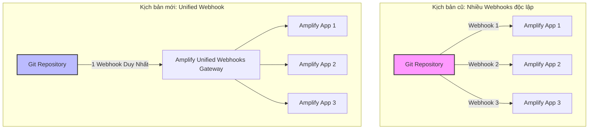

# HƯỚNG DẪN TỐI ƯU HÓA QUẢN LÝ ĐA ỨNG DỤNG (MULTI-APP) VỚI UNIFIED WEBHOOKS TRÊN AWS AMPLIFY HOSTING

Trong phát triển phần mềm hiện đại, kiến trúc **Monorepo** (quản lý nhiều ứng dụng, services trong cùng một repository) ngày càng được các team phát triển frontend ưa chuộng nhờ khả năng chia sẻ code dễ dàng và đơn giản hóa quy trình quản lý dự án. Tuy nhiên, khi triển khai deploy các ứng dụng này lên **AWS Amplify Hosting**, các kỹ sư thường phải đối mặt với một "nỗi đau" (pain point) rất lớn: **Giới hạn số lượng Webhook của Git Provider**.

Mỗi khi bạn kết nối một ứng dụng Amplify mới trỏ tới cùng một repository, một webhook mới sẽ được sinh ra và đăng ký với Git provider. Điều này rất nhanh chóng dẫn đến việc chạm hạn mức giới hạn webhook của các Git provider phổ biến:
* **GitHub:** Giới hạn tối đa **20 webhooks** mỗi repository.
* **GitLab:** Giới hạn tối đa **100 webhooks** mỗi repository.
* **Bitbucket:** Giới hạn tối đa **50 webhooks** mỗi repository.

Khi chạm ngưỡng này, bạn không thể kết nối thêm ứng dụng Amplify mới hoặc kích hoạt các pipeline CI/CD khác, gây tắc nghẽn toàn bộ workflow của nhóm.

Để giải quyết triệt để bài toán này, AWS đã ra mắt tính năng **Unified Webhooks trên AWS Amplify Hosting**, cho phép gộp tất cả các webhook liên quan đến Amplify thành một webhook duy nhất cho toàn bộ repository.

{}
**Lợi ích cốt lõi:** Một webhook duy nhất đại diện cho AWS Amplify Hosting trên repository của bạn, tự động phân phối tín hiệu trigger đến tất cả ứng dụng Amplify tương ứng bên trong.
{}

---

## Cơ Chế Hoạt Động của Unified Webhooks

Hãy xem luồng xử lý trước và sau khi áp dụng Unified Webhooks để thấy sự khác biệt:

---

## Các Lợi Ích Vượt Trội

Việc áp dụng Unified Webhooks mang lại nhiều lợi ích to lớn cho doanh nghiệp và đội ngũ phát triển:

* **Vượt qua giới hạn của Git Provider:** Không còn lo lắng về việc chạm ngưỡng 20 webhooks của GitHub, thoải mái mở rộng quy mô dự án monorepo với hàng chục ứng dụng frontend.
* **Tăng tính linh hoạt cho Monorepo:** Hỗ trợ mô hình phát triển Agile, cho phép tạo và phá hủy các ứng dụng Amplify tạm thời (ví dụ: preview environments cho từng Pull Request) mà không ảnh hưởng tới hạn mức webhook.
* **Đơn giản hóa quản lý hạ tầng:** Giảm thiểu sự phức tạp khi cấu hình tích hợp giữa Git provider và AWS. Tránh tình trạng webhook bị lỗi hoặc mất đồng bộ.
* **Giải phóng slot webhook:** Nhường chỗ cho các dịch vụ CI/CD và công cụ tự động hóa khác của bên thứ ba (như Slack notification, SonarQube, security scan...).

---

## Hướng Dẫn Triển Khai Nhanh (Quick Walkthrough)

Tính năng Unified Webhooks cực kỳ dễ kích hoạt:

### 1. Đối với các ứng dụng Amplify mới tạo
Tính năng này sẽ được **tự động áp dụng** ngay khi bạn liên kết ứng dụng với repository. Bạn không cần thực hiện thêm bất kỳ bước thủ công nào.

### 2. Đối với các ứng dụng Amplify hiện hữu (đang chạy)
Bạn chỉ cần thực hiện tái kết nối (Reconnect) repository theo các bước sau:
1. Truy cập vào **AWS Management Console** -> Chọn **AWS Amplify**.
2. Chọn ứng dụng cần cấu hình -> Vào mục **App settings** ở menu trái.
3. Chọn **Branch settings** (Cài đặt nhánh).
4. Click chọn nút **Reconnect repository** (Kết nối lại repository) và thực hiện xác thực theo hướng dẫn. Hệ thống sẽ tự động gộp webhook của app này vào webhook duy nhất của repo.

---

## Các Lưu Ý Quan Trọng & Kết Luận

### Một số lưu ý khi triển khai:
* **Dọn dẹp trước khi migrate:** Nếu repository của bạn đã bị full webhook trước đó (chạm mốc 20/20 trên GitHub), bạn hãy chủ động xóa bớt các webhook Amplify cũ trước khi tiến hành nhấn "Reconnect" để quá trình tạo webhook duy nhất không bị lỗi.
* **Tính chất Region-based:** Unified Webhooks hoạt động trên cơ sở từng vùng (region-based). Nếu bạn có các ứng dụng Amplify ở các AWS Region khác nhau trỏ chung một repository, hệ thống sẽ tạo một unified webhook cho mỗi Region.

### Kết luận:
> Tính năng Unified Webhooks là một cải tiến "nhỏ nhưng có võ" từ AWS Amplify Hosting. Nó giúp giải phóng các Frontend Developer khỏi các rắc rối liên quan đến quản lý kết nối hạ tầng và giới hạn webhook, mang lại trải nghiệm phát triển Monorepo mượt mà, giúp tăng tốc độ phân phối sản phẩm đến tay khách hàng.

---
* **Link bài đăng cộng đồng:** [AWS Study Group Facebook Post](https://www.facebook.com/groups/awsstudygroupfcj/permalink/2190199598411667/)
* **Hashtags:** #AWS #AmplifyHosting #UnifiedWebhooks #Monorepo #FrontendDev #awsstudygroup
