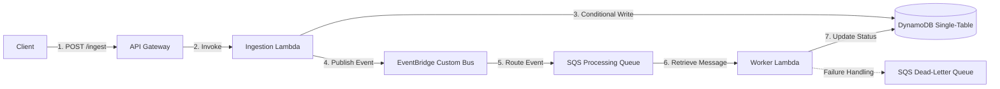

# Module 4: Serverless Backend & Observability

In this section, you will implement the asynchronous data ingestion and event processing logic (Asynchronous Data Ingestion & Event Processing) using the modular **AWS SDK v3** in TypeScript. This architecture utilizes an event-driven model (Event-Driven Architecture) via API Gateway, AWS Lambda, DynamoDB (Single-Table Design), Amazon SQS, Dead-Letter Queue (DLQ), and Amazon EventBridge.

---

## Part 1: Overview & Prerequisites

### 1. System Architecture Flow
To handle load spikes, achieve component decoupling, and ensure data safety, the system implements an event-driven asynchronous processing model:
1. **Ingestion Lambda** receives request payloads from API Gateway.
2. The Lambda performs a **Conditional Write** to DynamoDB, initializing the request status as `PENDING` and storing an `Idempotency-Key` to prevent duplicate processing.
3. It integrates with a third-party service (simulated).
4. After successful integration, the Lambda publishes a `data.received` event to the **EventBridge Custom Bus**.
5. EventBridge routes this event to the **SQS Processing Queue**.
6. **Worker Lambda (SQS Consumer)** polls the messages in batches, verifies duplicates (Idempotent Consumer), updates the record status in DynamoDB to `COMPLETED`, and handles further business logic.
7. Any messages that fail repeatedly are eventually routed to a **Dead-Letter Queue (DLQ)** for later handling.



### 2. Install NPM Dependencies
AWS SDK v3 is designed modularly, which reduces Lambda package sizes and significantly improves cold-start times.

Run the following command in the directory containing the Lambda source code:
```bash
npm install @aws-sdk/client-dynamodb @aws-sdk/client-sqs @aws-sdk/client-eventbridge @aws-sdk/lib-dynamodb
npm install --save-dev @types/aws-lambda typescript
```

---

## Part 2: Step-by-Step SDK Implementation

### 1. Ingestion Service Lambda (Event Publishing Flow)
Implement the Lambda handling the ingestion flow: it executes a conditional write with an `Idempotency-Key` in DynamoDB, and then publishes an event to the EventBridge Custom Bus.

Create the file `services/ingestion/index.ts`:
```typescript
import { APIGatewayProxyEvent, APIGatewayProxyResult } from "aws-lambda";
import { DynamoDBClient } from "@aws-sdk/client-dynamodb";
import { DynamoDBDocumentClient, PutCommand } from "@aws-sdk/lib-dynamodb";
import { EventBridgeClient, PutEventsCommand } from "@aws-sdk/client-eventbridge";

// Initialize SDK Clients outside the handler to reuse connections across Lambda executions
const ddbClient = new DynamoDBClient({});
const docClient = DynamoDBDocumentClient.from(ddbClient);
const eventBridgeClient = new EventBridgeClient({});

const TABLE_NAME = process.env.TABLE_NAME || "";
const EVENT_BUS_NAME = process.env.EVENT_BUS_NAME || "";

export const handler = async (event: APIGatewayProxyEvent): Promise<APIGatewayProxyResult> => {
  console.log("Event received:", JSON.stringify(event));

  try {
    if (!event.body) {
      return {
        statusCode: 400,
        body: JSON.stringify({ error: "Missing request body" }),
      };
    }

    const { id, userId, dataPayload, idempotencyKey } = JSON.parse(event.body);

    // Validate required parameters
    if (!id || !userId || !dataPayload || !idempotencyKey) {
      return {
        statusCode: 400,
        body: JSON.stringify({ error: "Missing required fields: id, userId, dataPayload, idempotencyKey" }),
      };
    }

    const pk = `INGESTION#${id}`;
    const sk = "METADATA";

    console.log(`Performing conditional write for request: ${pk}`);
    
    try {
      // 1. Perform Conditional Write in DynamoDB to prevent duplicates
      await docClient.send(
        new PutCommand({
          TableName: TABLE_NAME,
          Item: {
            PK: pk,
            SK: sk,
            userId,
            dataPayload,
            status: "PENDING",
            idempotencyKey,
            createdAt: new Date().toISOString(),
            updatedAt: new Date().toISOString(),
          },
          // Condition: Only write if PK does not exist. Prevents overwriting on duplicate requests.
          ConditionExpression: "attribute_not_exists(PK)",
        })
      );
    } catch (dbError: any) {
      // Catch error when write condition fails (ID already exists)
      if (dbError.name === "ConditionalCheckFailedException") {
        console.warn(`Duplicate request detected with ID: ${id}`);
        return {
          statusCode: 409,
          body: JSON.stringify({ error: "Request already exists or is being processed" }),
        };
      }
      throw dbError; // Throw other DB errors to be handled globally
    }

    // 2. Simulate third-party service integration
    console.log(`Processing simulated integration for request ID: ${id}`);
    const isIntegrationSuccessful = await simulateThirdPartyCall(id);
    if (!isIntegrationSuccessful) {
      throw new Error("External integration transaction failed");
    }

    // 3. Publish data.received event to the Custom EventBridge Bus upon success
    console.log(`Publishing data.received event to custom bus: ${EVENT_BUS_NAME}`);
    const eventPayload = {
      id,
      userId,
      dataPayload,
      status: "INGESTED",
      idempotencyKey,
    };

    await eventBridgeClient.send(
      new PutEventsCommand({
        Entries: [
          {
            Source: "app.ingestion",
            DetailType: "data.received",
            Detail: JSON.stringify(eventPayload),
            EventBusName: EVENT_BUS_NAME,
          },
        ],
      })
    );

    return {
      statusCode: 201,
      headers: { "Access-Control-Allow-Origin": "*" },
      body: JSON.stringify({
        message: "Request successfully initialized",
        id,
        status: "PENDING",
      }),
    };
  } catch (error: any) {
    console.error("Error in Ingestion Handler:", error);
    return {
      statusCode: 500,
      body: JSON.stringify({ error: error.message || "Internal system error" }),
    };
  }
};

// Helper function to simulate a third-party API call
async function simulateThirdPartyCall(id: string): Promise<boolean> {
  // Simulate network latency
  await new Promise((resolve) => setTimeout(resolve, 500));
  // For testing: simulate a failure if the ID contains the string "fail"
  if (id.includes("fail")) {
    return false;
  }
  return true;
}
```

### 2. Worker Lambda Consumer (Asynchronous Flow via SQS)
Implement the Lambda processing SQS Queue: Poll messages, verify duplicates (Idempotent Consumer) using DynamoDB, update request status, and support partial batch failures (Partial Batch Failure).

Create the file `services/worker/index.ts`:
```typescript
import { SQSEvent, SQSBatchResponse, SQSRecord } from "aws-lambda";
import { DynamoDBClient } from "@aws-sdk/client-dynamodb";
import { DynamoDBDocumentClient, UpdateCommand, PutCommand } from "@aws-sdk/lib-dynamodb";

const ddbClient = new DynamoDBClient({});
const docClient = DynamoDBDocumentClient.from(ddbClient);
const TABLE_NAME = process.env.TABLE_NAME || "";

export const handler = async (event: SQSEvent): Promise<SQSBatchResponse> => {
  console.log(`Processing a batch of ${event.Records.length} SQS records`);
  
  const batchItemFailures: { itemIdentifier: string }[] = [];

  for (const record of event.Records) {
    try {
      await processMessage(record);
    } catch (err) {
      console.error(`Processing message ${record.messageId} failed:`, err);
      // Track the ID of the failed message
      batchItemFailures.push({ itemIdentifier: record.messageId });
    }
  }

  // Return list of failed messages so SQS retains them in the queue for retry,
  // while successfully processed messages are automatically deleted from the queue.
  return { batchItemFailures };
};

async function processMessage(record: SQSRecord): Promise<void> {
  const messageBody = JSON.parse(record.body);
  
  // Extract event details sent by EventBridge
  const details = messageBody.detail;
  if (!details || !details.id) {
    console.warn(`Invalid message format, skipping. Message ID: ${record.messageId}`);
    return;
  }

  const { id, userId, dataPayload } = details;

  // 1. Idempotent Consumer Pattern: Track processed message IDs
  // Goal: Prevent reprocessing duplicate SQS messages due to retry mechanisms or network instability
  const idempotencyPk = `IDEMPOTENCY#MSG#${record.messageId}`;
  const idempotencySk = `INGESTION#${id}`;

  try {
    await docClient.send(
      new PutCommand({
        TableName: TABLE_NAME,
        Item: {
          PK: idempotencyPk,
          SK: idempotencySk,
          processedAt: new Date().toISOString(),
          ttl: Math.floor(Date.now() / 1000) + 86400, // Auto-expire after 24 hours
        },
        ConditionExpression: "attribute_not_exists(PK)",
      })
    );
  } catch (dbError: any) {
    if (dbError.name === "ConditionalCheckFailedException") {
      console.warn(`SQS message already processed: ${record.messageId}. Skipping execution.`);
      return; // Ignore duplicate message execution safely without throwing error to prevent infinite retry loops
    }
    throw dbError;
  }

  // 2. Simulate failure scenario to test DLQ
  // If the dataPayload contains a failProcessing flag set to true, throw an error intentionally so the message is pushed to DLQ after exceeding maxReceiveCount
  if (dataPayload && dataPayload.failProcessing === true) {
    throw new Error(`[SIMULATED_FAILURE] Simulated failure for request ${id} due to failProcessing configuration`);
  }

  // 3. Update status to "COMPLETED" in the DynamoDB Single-Table
  console.log(`Updating status to COMPLETED for ID: ${id}`);
  await docClient.send(
    new UpdateCommand({
      TableName: TABLE_NAME,
      Key: {
        PK: `INGESTION#${id}`,
        SK: "METADATA",
      },
      UpdateExpression: "SET status = :status, updatedAt = :updatedAt",
      ExpressionAttributeValues: {
        ":status": "COMPLETED",
        ":updatedAt": new Date().toISOString(),
      },
    })
  );

  console.log(`Successfully processed request: ${id}`);
}
```

---

## Part 3: IAM & SQS Configurations

### 1. Configure Least Privilege Permissions
To ensure system security, set up IAM Roles with specific permissions, minimizing the use of administrator wildcard permissions (`*`).

Code declaration for corresponding infrastructure permissions in **AWS CDK (TypeScript)**:

```typescript
import * as iam from "aws-cdk-lib/aws-iam";
import * as sqs from "aws-cdk-lib/aws-sqs";
import * as lambda from "aws-cdk-lib/aws-lambda";
import * as dynamodb from "aws-cdk-lib/aws-dynamodb";
import * as events from "aws-cdk-lib/aws-events";

// A. Permissions for Ingestion Lambda
const ingestionLambda = new lambda.Function(this, "IngestionLambda", { /* ... */ });

// Allow Ingestion Lambda to write new records into DynamoDB
ingestionLambda.addToRolePolicy(new iam.PolicyStatement({
  effect: iam.Effect.ALLOW,
  actions: [
    "dynamodb:PutItem",
  ],
  resources: [props.table.tableArn],
}));

// Allow Ingestion Lambda to publish events to EventBridge Custom Bus
ingestionLambda.addToRolePolicy(new iam.PolicyStatement({
  effect: iam.Effect.ALLOW,
  actions: [
    "events:PutEvents",
  ],
  resources: [props.customEventBus.eventBusArn],
}));


// B. Permissions for Worker Lambda
const workerLambda = new lambda.Function(this, "WorkerLambda", { /* ... */ });

// Allow Worker Lambda to write idempotency markers and update request status
workerLambda.addToRolePolicy(new iam.PolicyStatement({
  effect: iam.Effect.ALLOW,
  actions: [
    "dynamodb:PutItem",
    "dynamodb:UpdateItem",
  ],
  resources: [props.table.tableArn],
}));

// Allow Worker Lambda to receive and delete SQS messages
workerLambda.addToRolePolicy(new iam.PolicyStatement({
  effect: iam.Effect.ALLOW,
  actions: [
    "sqs:ReceiveMessage",
    "sqs:DeleteMessage",
    "sqs:GetQueueAttributes"
  ],
  resources: [props.processingQueue.queueArn],
}));
```

### 2. Configure SQS Visibility Timeout
When integrating SQS as an AWS Lambda trigger, configuring the `visibilityTimeout` of the SQS queue is critical to system reliability.

```typescript
// Define Dead-Letter Queue (DLQ)
const processingDlq = new sqs.Queue(this, "ProcessingDLQ", {
  queueName: "processing-dlq",
  retentionPeriod: cdk.Duration.days(14), // Retained for 14 days for debugging
});

// Define Main Queue
const processingQueue = new sqs.Queue(this, "ProcessingQueue", {
  queueName: "processing-queue",
  // REQUIRED: visibilityTimeout must be greater than the maximum timeout of the Lambda Consumer
  visibilityTimeout: cdk.Duration.seconds(180), // 3 minutes
  deadLetterQueue: {
    queue: processingDlq,
    maxReceiveCount: 3, // Automatically route to DLQ after 3 failures
  },
});
```

#### Why must `visibilityTimeout` be greater than the Lambda Timeout?
- **How it works**: When Lambda polls SQS, it temporarily locks (hides) those messages from other pollers for the duration of the `visibilityTimeout`.
- **If the `visibilityTimeout` is too short**: For example, if the Lambda timeout is 30 seconds but the SQS `visibilityTimeout` is set to 15 seconds. If processing a heavy message takes 20 seconds:
  1. At the 15th second, SQS automatically unlocks the message since the visibility window expired.
  2. Another Lambda instance will immediately poll the exact same message and run it in parallel.
  3. This leads to duplicate executions and race conditions.
- **Golden Rule**: Always configure the SQS `visibilityTimeout` to be **at least 6 times** the maximum timeout of the Lambda Consumer, plus a small buffer.

---

## Part 4: Testing & Observability

### 1. Sample Test Payloads

#### Scenario A: Successful Ingestion API Call (API Gateway Request)
Use the following payload to invoke the HTTP `POST /ingest` endpoint on API Gateway:

```json
{
  "id": "REQ-2026-999-TEST",
  "userId": "usr_998877",
  "idempotencyKey": "uuid-550e8400-e29b-41d4-a716-446655440000",
  "dataPayload": {
    "key": "val",
    "someNumeric": 100.5
  }
}
```

*Expected Result (First Invocation)*:
HTTP status `201 Created` returning `{"message":"Request successfully initialized","id":"REQ-2026-999-TEST","status":"PENDING"}`.

*Expected Result (Second Invocation with identical payload)*:
HTTP status `409 Conflict` returning `{"error":"Request already exists or is being processed"}` (verifies Idempotency logic works).

#### Scenario B: Testing the Dead-Letter Queue (DLQ)
Send an ingestion request containing the `failProcessing: true` property to simulate a processing failure:

```json
{
  "id": "REQ-2026-FAIL-DLQ",
  "userId": "usr_fail_test",
  "idempotencyKey": "uuid-fail-dlq-test-001",
  "dataPayload": {
    "failProcessing": true
  }
}
```

*Test Execution Flow*:
1. Ingestion Lambda accepts the request, records the pending status in DynamoDB, and publishes the event to EventBridge.
2. SQS receives the event and triggers the Worker Lambda.
3. The Worker detects the `failProcessing: true` property and throws a simulated error: `[SIMULATED_FAILURE] Simulated failure...`.
4. The message is returned to the SQS queue. SQS retries up to 3 times (`maxReceiveCount`).
5. After the 3rd failed attempt, the message is automatically moved to the dead-letter queue `processing-dlq`.

---

### 2. Observability & Tracing

#### A. Querying Structured Logs in CloudWatch Logs
Since the Lambda logs are written using `console.log(JSON.stringify(event))` or serialized JSON, CloudWatch Logs stores them as **Structured Logs**. You can use **CloudWatch Logs Insights** to quickly query logs:

```sql
fields @timestamp, @message, id, error
| filter @message like /Error/ or @message like /ConditionalCheckFailedException/
| sort @timestamp desc
| limit 20
```

#### B. Enable Distributed Tracing with AWS X-Ray
Trace requests end-to-end from API Gateway -> SQS -> Lambda -> EventBridge -> DynamoDB:

1. **Enable Active Tracing** for Lambda in CDK:
   ```typescript
   const ingestionLambda = new lambda.Function(this, "IngestionLambda", {
     // ...
     tracing: lambda.Tracing.ACTIVE
   });
   ```
2. **Enable Tracing on API Gateway Stage**:
   ```typescript
   const api = new apigateway.RestApi(this, "AppRestApi", {
     deployOptions: {
       tracingEnabled: true
     }
   });
   ```
3. **Analyze the Trace Map**:
   Navigate to AWS Console -> **CloudWatch** -> **X-Ray traces** -> **Service map**. The map will clearly display the request flow, latency, and error rates of each node in the architecture.


*Figure 7: Service Map showing the tracing flow between services in CloudWatch X-Ray*
