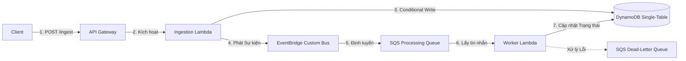

# Module 4: Hạ tầng Serverless Backend & Lập trình ứng dụng với AWS SDK v3

Trong phần này, bạn sẽ triển khai logic tiếp nhận dữ liệu và xử lý sự kiện bất đồng bộ (Asynchronous Data Ingestion & Event Processing) sử dụng **AWS SDK v3** viết bằng TypeScript. Kiến trúc này sử dụng mô hình hướng sự kiện (Event-Driven Architecture) thông qua API Gateway, AWS Lambda, DynamoDB (Single-Table Design), Amazon SQS, DLQ và Amazon EventBridge.

---

## Phần 1: Tổng quan và Chuẩn bị (Overview & Prerequisites)

### 1. Luồng kiến trúc hệ thống
Để chịu tải tốt hơn, tách biệt xử lý (decoupling) và đảm bảo an toàn dữ liệu, hệ thống triển khai mô hình xử lý bất đồng bộ hướng sự kiện:
1. **Ingestion Lambda** tiếp nhận yêu cầu từ API Gateway.
2. Lambda thực hiện ghi có điều kiện (**Conditional Write**) vào DynamoDB để khởi tạo trạng thái yêu cầu là `PENDING` và lưu vết `Idempotency-Key` nhằm ngăn chặn xử lý trùng lặp.
3. Tích hợp với một dịch vụ bên thứ ba (mô phỏng).
4. Sau khi tích hợp thành công, Lambda gửi sự kiện `data.received` lên **EventBridge Custom Bus**.
5. EventBridge định tuyến sự kiện này đến **SQS Processing Queue**.
6. **Worker Lambda (SQS Consumer)** định kỳ nhận message theo lô (Batch), kiểm tra trùng lặp (Idempotent Consumer), cập nhật trạng thái bản ghi trong DynamoDB thành `COMPLETED` và thực hiện các xử lý nghiệp vụ tiếp theo.
7. Mọi message xử lý thất bại liên tục sẽ được đưa vào **Dead-Letter Queue (DLQ)** để xử lý sau.



### 2. Cài đặt các thư viện (NPM Dependencies)
AWS SDK v3 được thiết kế dưới dạng modular (chia nhỏ thư viện), giúp giảm dung lượng gói code Lambda và cải thiện đáng kể thời gian khởi động lạnh (cold-start).

Chạy lệnh sau tại thư mục chứa source code Lambda:
```bash
npm install @aws-sdk/client-dynamodb @aws-sdk/client-sqs @aws-sdk/client-eventbridge @aws-sdk/lib-dynamodb
npm install --save-dev @types/aws-lambda typescript
```

---

## Phần 2: Hướng dẫn mã nguồn chi tiết (Step-by-Step SDK Implementation)

### 1. Ingestion Service Lambda (Luồng Phát sự kiện)
Viết Lambda xử lý luồng tiếp nhận: thực hiện ghi có điều kiện kèm theo `Idempotency-Key` vào DynamoDB, sau đó phát sự kiện lên EventBridge Custom Bus.

Tạo tệp tin `services/ingestion/index.ts`:
```typescript
import { APIGatewayProxyEvent, APIGatewayProxyResult } from "aws-lambda";
import { DynamoDBClient } from "@aws-sdk/client-dynamodb";
import { DynamoDBDocumentClient, PutCommand } from "@aws-sdk/lib-dynamodb";
import { EventBridgeClient, PutEventsCommand } from "@aws-sdk/client-eventbridge";

// Khởi tạo các SDK Client ngoài handler để tái sử dụng giữa các lần thực thi Lambda
const ddbClient = new DynamoDBClient({});
const docClient = DynamoDBDocumentClient.from(ddbClient);
const eventBridgeClient = new EventBridgeClient({});

const TABLE_NAME = process.env.TABLE_NAME || "";
const EVENT_BUS_NAME = process.env.EVENT_BUS_NAME || "";

export const handler = async (event: APIGatewayProxyEvent): Promise<APIGatewayProxyResult> => {
  console.log("Sự kiện nhận được:", JSON.stringify(event));

  try {
    if (!event.body) {
      return {
        statusCode: 400,
        body: JSON.stringify({ error: "Thiếu nội dung yêu cầu (body)" }),
      };
    }

    const { id, userId, dataPayload, idempotencyKey } = JSON.parse(event.body);

    // Xác thực các tham số đầu vào bắt buộc
    if (!id || !userId || !dataPayload || !idempotencyKey) {
      return {
        statusCode: 400,
        body: JSON.stringify({ error: "Thiếu trường bắt buộc: id, userId, dataPayload, idempotencyKey" }),
      };
    }

    const pk = `INGESTION#${id}`;
    const sk = "METADATA";

    console.log(`Đang thực hiện ghi có điều kiện cho yêu cầu: ${pk}`);
    
    try {
      // 1. Thực hiện Conditional Write vào DynamoDB để ngăn trùng lặp
      await docClient.send(
        new PutCommand({
          TableName: TABLE_NAME,
          Item: {
            PK: pk,
            SK: sk,
            userId,
            dataPayload,
            status: "PENDING",
            idempotencyKey,
            createdAt: new Date().toISOString(),
            updatedAt: new Date().toISOString(),
          },
          // Điều kiện: Chỉ ghi nếu PK chưa tồn tại. Tránh ghi đè khi khách hàng gửi trùng request.
          ConditionExpression: "attribute_not_exists(PK)",
        })
      );
    } catch (dbError: any) {
      // Bắt lỗi khi điều kiện ghi không thỏa mãn (đã tồn tại ID này)
      if (dbError.name === "ConditionalCheckFailedException") {
        console.warn(`Phát hiện gửi trùng yêu cầu với ID: ${id}`);
        return {
          statusCode: 409,
          body: JSON.stringify({ error: "Yêu cầu đã tồn tại hoặc đang được xử lý" }),
        };
      }
      throw dbError; // Đẩy các lỗi DB khác ra ngoài để xử lý chung
    }

    // 2. Mô phỏng cuộc gọi sang dịch vụ bên thứ ba
    console.log(`Đang xử lý tích hợp mô phỏng cho ID yêu cầu: ${id}`);
    const isIntegrationSuccessful = await simulateThirdPartyCall(id);
    if (!isIntegrationSuccessful) {
      throw new Error("Giao dịch tích hợp bên ngoài thất bại");
    }

    // 3. Phát sự kiện data.received lên EventBridge Custom Bus sau khi thành công
    console.log(`Đang phát sự kiện data.received lên custom bus: ${EVENT_BUS_NAME}`);
    const eventPayload = {
      id,
      userId,
      dataPayload,
      status: "INGESTED",
      idempotencyKey,
    };

    await eventBridgeClient.send(
      new PutEventsCommand({
        Entries: [
          {
            Source: "app.ingestion",
            DetailType: "data.received",
            Detail: JSON.stringify(eventPayload),
            EventBusName: EVENT_BUS_NAME,
          },
        ],
      })
    );

    return {
      statusCode: 201,
      headers: { "Access-Control-Allow-Origin": "*" },
      body: JSON.stringify({
        message: "Khởi tạo yêu cầu thành công",
        id,
        status: "PENDING",
      }),
    };
  } catch (error: any) {
    console.error("Lỗi xảy ra trong Ingestion Handler:", error);
    return {
      statusCode: 500,
      body: JSON.stringify({ error: error.message || "Lỗi hệ thống nội bộ" }),
    };
  }
};

// Hàm mô phỏng cuộc gọi API bên thứ ba
async function simulateThirdPartyCall(id: string): Promise<boolean> {
  // Giả lập độ trễ mạng
  await new Promise((resolve) => setTimeout(resolve, 500));
  // Để kiểm thử: nếu ID chứa chuỗi "fail" thì giả lập lỗi
  if (id.includes("fail")) {
    return false;
  }
  return true;
}
```

### 2. Worker Lambda Consumer (Luồng Xử lý bất đồng bộ qua SQS)
Viết Lambda xử lý SQS Queue: Đọc message, kiểm tra trùng lặp (Idempotent Consumer) thông qua DynamoDB, cập nhật trạng thái yêu cầu và hỗ trợ xử lý lỗi từng phần (Partial Batch Failure).

Tạo tệp tin `services/worker/index.ts`:
```typescript
import { SQSEvent, SQSBatchResponse, SQSRecord } from "aws-lambda";
import { DynamoDBClient } from "@aws-sdk/client-dynamodb";
import { DynamoDBDocumentClient, UpdateCommand, PutCommand } from "@aws-sdk/lib-dynamodb";

const ddbClient = new DynamoDBClient({});
const docClient = DynamoDBDocumentClient.from(ddbClient);
const TABLE_NAME = process.env.TABLE_NAME || "";

export const handler = async (event: SQSEvent): Promise<SQSBatchResponse> => {
  console.log(`Đang xử lý một loạt gồm ${event.Records.length} bản ghi SQS`);
  
  const batchItemFailures: { itemIdentifier: string }[] = [];

  for (const record of event.Records) {
    try {
      await processMessage(record);
    } catch (err) {
      console.error(`Xử lý tin nhắn ${record.messageId} thất bại:`, err);
      // Ghi nhận ID của tin nhắn bị lỗi
      batchItemFailures.push({ itemIdentifier: record.messageId });
    }
  }

  // Trả về danh sách tin nhắn lỗi để SQS giữ lại trong queue và thực hiện retry,
  // đồng thời tự động xóa các tin nhắn đã xử lý thành công khỏi queue.
  return { batchItemFailures };
};

async function processMessage(record: SQSRecord): Promise<void> {
  const messageBody = JSON.parse(record.body);
  
  // Trích xuất dữ liệu chi tiết sự kiện do EventBridge gửi đến
  const details = messageBody.detail;
  if (!details || !details.id) {
    console.warn(`Định dạng tin nhắn không hợp lệ, bỏ qua. Message ID: ${record.messageId}`);
    return;
  }

  const { id, userId, dataPayload } = details;

  // 1. Idempotent Consumer Pattern: Ghi nhận vết xử lý tin nhắn
  // Mục tiêu: Tránh xử lý lại tin nhắn SQS trùng lặp do cơ chế retry hoặc mạng chập chờn
  const idempotencyPk = `IDEMPOTENCY#MSG#${record.messageId}`;
  const idempotencySk = `INGESTION#${id}`;

  try {
    await docClient.send(
      new PutCommand({
        TableName: TABLE_NAME,
        Item: {
          PK: idempotencyPk,
          SK: idempotencySk,
          processedAt: new Date().toISOString(),
          ttl: Math.floor(Date.now() / 1000) + 86400, // Tự động xóa sau 24 giờ
        },
        ConditionExpression: "attribute_not_exists(PK)",
      })
    );
  } catch (dbError: any) {
    if (dbError.name === "ConditionalCheckFailedException") {
      console.warn(`Tin nhắn SQS đã được xử lý trước đó: ${record.messageId}. Bỏ qua xử lý.`);
      return; // Bỏ qua an toàn mà không báo lỗi để tránh retry vô hạn
    }
    throw dbError;
  }

  // 2. Kịch bản mô phỏng xử lý thất bại để kiểm thử DLQ
  // Nếu dataPayload chứa cờ failProcessing là true, cố tình ném ra lỗi để tin nhắn bị đẩy vào DLQ sau khi vượt maxReceiveCount
  if (dataPayload && dataPayload.failProcessing === true) {
    throw new Error(`[SIMULATED_FAILURE] Lỗi mô phỏng cho yêu cầu ${id} do có cấu hình failProcessing`);
  }

  // 3. Cập nhật trạng thái thành "COMPLETED" trong DynamoDB Single-Table
  console.log(`Đang cập nhật trạng thái thành COMPLETED cho ID: ${id}`);
  await docClient.send(
    new UpdateCommand({
      TableName: TABLE_NAME,
      Key: {
        PK: `INGESTION#${id}`,
        SK: "METADATA",
      },
      UpdateExpression: "SET status = :status, updatedAt = :updatedAt",
      ExpressionAttributeValues: {
        ":status": "COMPLETED",
        ":updatedAt": new Date().toISOString(),
      },
    })
  );

  console.log(`Hoàn tất xử lý yêu cầu thành công: ${id}`);
}
```

---

## Phần 3: Cấu hình phân quyền & Tham số hạ tầng (IAM & SQS Configurations)

### 1. Thiết lập phân quyền tối thiểu (Least Privilege)
Để bảo đảm tính an toàn cho hệ thống, hãy thiết lập IAM Role với các quyền cụ thể, hạn chế tối đa việc sử dụng quyền Admin (`*`).

Mã nguồn khai báo phân quyền hạ tầng tương ứng trong **AWS CDK (TypeScript)**:

```typescript
import * as iam from "aws-cdk-lib/aws-iam";
import * as sqs from "aws-cdk-lib/aws-sqs";
import * as lambda from "aws-cdk-lib/aws-lambda";
import * as dynamodb from "aws-cdk-lib/aws-dynamodb";
import * as events from "aws-cdk-lib/aws-events";

// A. Phân quyền cho Ingestion Lambda
const ingestionLambda = new lambda.Function(this, "IngestionLambda", { /* ... */ });

// Cho phép Ingestion Lambda ghi bản ghi mới vào bảng DynamoDB
ingestionLambda.addToRolePolicy(new iam.PolicyStatement({
  effect: iam.Effect.ALLOW,
  actions: [
    "dynamodb:PutItem",
  ],
  resources: [props.table.tableArn],
}));

// Cho phép Ingestion Lambda đẩy sự kiện lên Custom EventBus của EventBridge
ingestionLambda.addToRolePolicy(new iam.PolicyStatement({
  effect: iam.Effect.ALLOW,
  actions: [
    "events:PutEvents",
  ],
  resources: [props.customEventBus.eventBusArn],
}));


// B. Phân quyền cho Worker Lambda
const workerLambda = new lambda.Function(this, "WorkerLambda", { /* ... */ });

// Cho phép Worker Lambda ghi vết idempotency và cập nhật trạng thái yêu cầu
workerLambda.addToRolePolicy(new iam.PolicyStatement({
  effect: iam.Effect.ALLOW,
  actions: [
    "dynamodb:PutItem",
    "dynamodb:UpdateItem",
  ],
  resources: [props.table.tableArn],
}));

// Cho phép Worker Lambda lấy tin nhắn và xóa khỏi SQS queue
workerLambda.addToRolePolicy(new iam.PolicyStatement({
  effect: iam.Effect.ALLOW,
  actions: [
    "sqs:ReceiveMessage",
    "sqs:DeleteMessage",
    "sqs:GetQueueAttributes"
  ],
  resources: [props.processingQueue.queueArn],
}));
```

### 2. Cấu hình thời gian hiển thị (SQS Visibility Timeout)
Khi liên kết SQS làm trigger cho AWS Lambda, cấu hình `visibilityTimeout` của hàng đợi SQS đóng vai trò vô cùng quan trọng đối với độ tin cậy của hệ thống.

```typescript
// Định nghĩa hàng đợi lỗi (Dead-Letter Queue)
const processingDlq = new sqs.Queue(this, "ProcessingDLQ", {
  queueName: "processing-dlq",
  retentionPeriod: cdk.Duration.days(14), // Lưu lại trong vòng 14 ngày để gỡ lỗi
});

// Định nghĩa hàng đợi chính (Main Queue)
const processingQueue = new sqs.Queue(this, "ProcessingQueue", {
  queueName: "processing-queue",
  // BẮT BUỘC: visibilityTimeout phải lớn hơn thời gian timeout tối đa của Lambda Consumer
  visibilityTimeout: cdk.Duration.seconds(180), // 3 phút
  deadLetterQueue: {
    queue: processingDlq,
    maxReceiveCount: 3, // Tự động chuyển sang DLQ sau 3 lần xử lý thất bại
  },
});
```

#### Tại sao `visibilityTimeout` phải lớn hơn Timeout của Lambda?
- **Nguyên lý hoạt động**: Khi Lambda thăm dò (poll) SQS, nó sẽ tạm thời khóa (hide) các tin nhắn đó khỏi các tiến trình thăm dò khác trong thời gian `visibilityTimeout`.
- **Nếu `visibilityTimeout` quá ngắn**: Ví dụ, timeout của Lambda là 30 giây nhưng `visibilityTimeout` của SQS chỉ cài đặt 15 giây. Khi xử lý một tin nhắn nặng mất 20 giây:
  1. Ở giây thứ 15, SQS tự động mở khóa tin nhắn vì hết thời gian ẩn.
  2. Một instance Lambda khác sẽ lập tức nhận lại đúng tin nhắn đó và chạy xử lý song song.
  3. Điều này gây nên tình trạng xử lý trùng lặp (duplicate executions) và tranh chấp tài nguyên (race condition).
- **Quy tắc vàng**: Hãy luôn cấu hình `visibilityTimeout` của SQS **tối thiểu bằng 6 lần** thời gian timeout tối đa của Lambda Consumer, kết hợp thêm một chút buffer.

---

## Phần 4: Kiểm thử và Kiểm tra Vận hành (Testing & Observability)

### 1. Dữ liệu kiểm thử mẫu (JSON Payload)

#### Kịch bản A: Gọi API Ingestion thành công (API Gateway Request)
Sử dụng payload sau để gọi HTTP `POST /ingest` của API Gateway:

```json
{
  "id": "REQ-2026-999-TEST",
  "userId": "usr_998877",
  "idempotencyKey": "uuid-550e8400-e29b-41d4-a716-446655440000",
  "dataPayload": {
    "key": "val",
    "someNumeric": 100.5
  }
}
```

*Kết quả mong đợi (Lần gọi đầu tiên)*:
Mã HTTP `201 Created` trả về nội dung `{"message":"Khởi tạo yêu cầu thành công","id":"REQ-2026-999-TEST","status":"PENDING"}`.

*Kết quả mong đợi (Lần gọi thứ hai với cùng một nội dung)*:
Mã HTTP `409 Conflict` trả về nội dung `{"error":"Yêu cầu đã tồn tại hoặc đang được xử lý"}` (Cơ chế Idempotency hoạt động tốt).

#### Kịch bản B: Kiểm thử cơ chế Dead-Letter Queue (DLQ)
Gửi yêu cầu ingest chứa thuộc tính `failProcessing: true` để bắt lỗi mô phỏng:

```json
{
  "id": "REQ-2026-FAIL-DLQ",
  "userId": "usr_fail_test",
  "idempotencyKey": "uuid-fail-dlq-test-001",
  "dataPayload": {
    "failProcessing": true
  }
}
```

*Luồng kiểm thử hoạt động*:
1. Ingestion Lambda tiếp nhận, ghi trạng thái yêu cầu thành công và phát sự kiện lên EventBridge.
2. SQS nhận sự kiện từ EventBridge, kích hoạt Worker Lambda Consumer.
3. Worker gặp phải thuộc tính `failProcessing: true`, ném ra lỗi `[SIMULATED_FAILURE] Lỗi mô phỏng...`.
4. Message được trả ngược về SQS. Tiến trình này thử lại tối đa 3 lần (`maxReceiveCount`).
5. Sau lần thất bại thứ 3, tin nhắn tự động được định tuyến sang hàng đợi lỗi `processing-dlq`.

---

### 2. Khả năng quan sát (Observability) & Truy vết (Tracing)

#### A. Tra cứu Logs cấu trúc trên CloudWatch Logs
Do chúng ta sử dụng `console.log(JSON.stringify(event))` hoặc ghi log theo định dạng JSON, CloudWatch Logs sẽ lưu trữ dưới dạng **Structured Log**. Bạn có thể dùng **CloudWatch Logs Insights** để truy vấn nhanh:

```sql
fields @timestamp, @message, id, error
| filter @message like /Error/ or @message like /ConditionalCheckFailedException/
| sort @timestamp desc
| limit 20
```

#### B. Kích hoạt Distributed Tracing với AWS X-Ray
Theo dõi luồng request đi xuyên suốt từ API Gateway -> SQS -> Lambda -> EventBridge -> DynamoDB:

1. **Bật Active Tracing** trong CDK cho Lambda:
   ```typescript
   const ingestionLambda = new lambda.Function(this, "IngestionLambda", {
     // ...
     tracing: lambda.Tracing.ACTIVE
   });
   ```
2. **Bật Tracing trên API Gateway Stage**:
   ```typescript
   const api = new apigateway.RestApi(this, "AppRestApi", {
     deployOptions: {
       tracingEnabled: true
     }
   });
   ```
3. **Phân tích Trace Map**:
   Truy cập AWS Console -> **CloudWatch** -> **X-Ray traces** -> **Service map**. Bản đồ sẽ hiển thị rõ ràng đường đi của request, thời gian trễ (latency), tỷ lệ lỗi của từng node trong mạng lưới.
